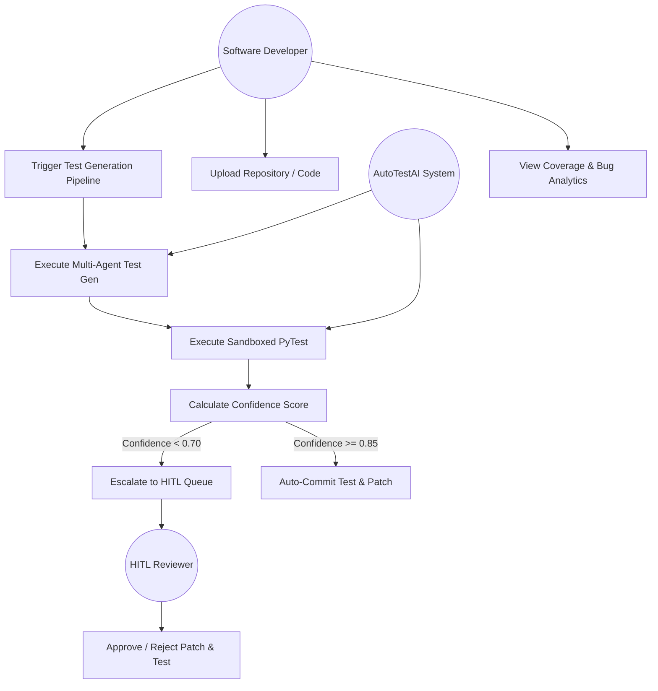
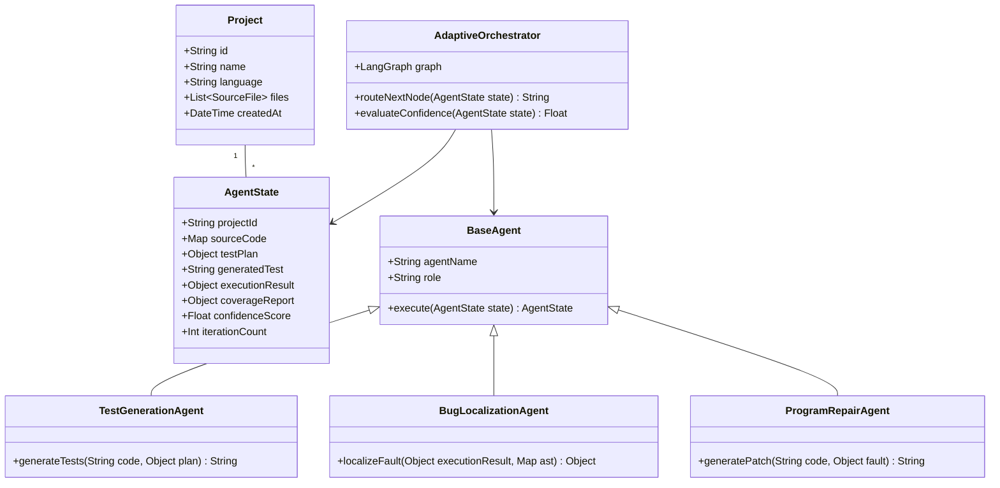
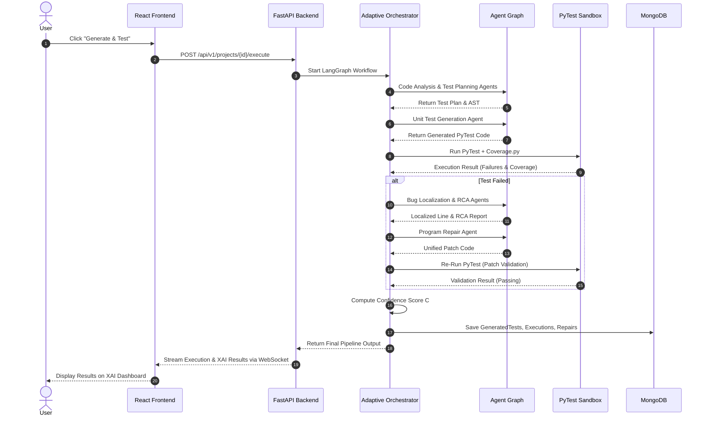
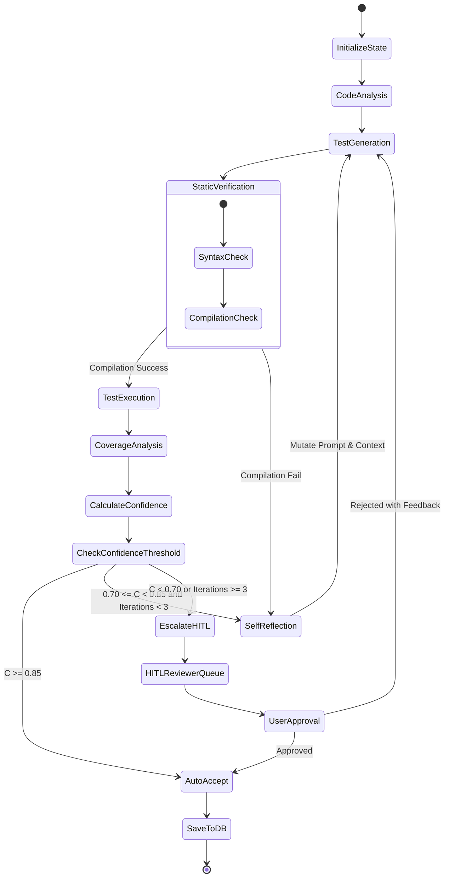
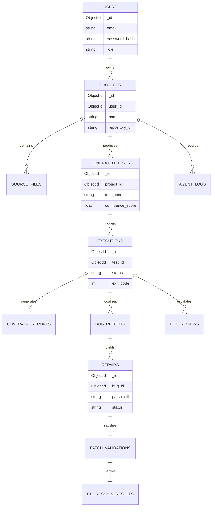

# Phase 3: System Architecture & UML Design Specifications

---

## 1. High-Level System Architecture

AutoTestAI is structured as an end-to-end, multi-layered agentic system. The system separates user interaction, API orchestration, autonomous agent reasoning, execution sandboxing, and database storage into decoupled tiers.

```
+-----------------------------------------------------------------------------------+
|                                  PRESENTATION TIER                                |
|   +---------------------------------------------------------------------------+   |
|   |         React 18 + TypeScript + Tailwind CSS + XAI Visualizer             |   |
|   |   [Dashboard] [Project Mgr] [Test Gen UI] [HITL Review] [Analytics]       |   |
|   +---------------------------------------------------------------------------+   |
+-----------------------------------------------------------------------------------+
                                          | HTTP REST / WebSockets
                                          v
+-----------------------------------------------------------------------------------+
|                                 APPLICATION TIER                                  |
|   +---------------------------------------------------------------------------+   |
|   |                         FastAPI Application Core                          |   |
|   |  - Authentication Service      - Project Service     - Agent Gateway      |   |
|   |  - Execution Engine Controller - Repair Service      - Analytics Engine   |   |
|   +---------------------------------------------------------------------------+   |
+-----------------------------------------------------------------------------------+
                                          |
                                          v
+-----------------------------------------------------------------------------------+
|                             AGENTIC REASONING TIER                                |
|   +---------------------------------------------------------------------------+   |
|   |                     LangGraph Multi-Agent Orchestrator                    |   |
|   |  - State Graph Engine         - Self-Reflection Loop Engine               |   |
|   |  - 14 Specialized Agents      - Confidence Decision Module ($C_{score}$)  |   |
|   +---------------------------------------------------------------------------+   |
+-----------------------------------------------------------------------------------+
                     |                                      |
                     v Execution Telemetry                  v Database Operations
+------------------------------------------+  +-------------------------------------+
|            EXECUTION TIER                |  |           DATA TIER                 |
|  +------------------------------------+  |  |  +-------------------------------+  |
|  |     Subprocess PyTest Sandbox      |  |  |  |      MongoDB Database         |  |
|  |  (Code Exec, Coverage.py, SBFL)    |  |  |  |   (12 Core Collections)      |  |
|  +------------------------------------+  |  |  +-------------------------------+  |
+------------------------------------------+  +-------------------------------------+
```

---

## 2. Low-Level Module Design

### 2.1 Agent State Management Node (LangGraph State)
The orchestration relies on a shared `AgentState` object passed across graph nodes:
* `project_id`: Current active project identifier.
* `source_code`: Code dictionary mapped by filepath.
* `ast_data`: Parsed Abstract Syntax Trees & function symbols.
* `test_plan`: Generated test plan specification.
* `generated_code`: Latest candidate PyTest code.
* `execution_result`: Output from PyTest execution sandbox (stdout, stderr, exit_code, duration).
* `coverage_report`: Percentage line/branch coverage and missing lines.
* `localization_report`: Localized faulty file, function, and line numbers.
* `patch_code`: Unified diff patch produced by repair agent.
* `confidence_score`: Float value $C \in [0.0, 1.0]$.
* `iteration_count`: Current self-reflection retry loop index.
* `status`: State status (`PLANNING`, `GENERATING`, `EXECUTING`, `LOCALIZING`, `REPAIRING`, `HITL_REQUIRED`, `COMPLETED`).

---

## 3. Specifications for 7 Core UML Diagrams

### 3.1 Use Case Diagram Specification
**Actors**: Software Developer, QA Engineer, HITL Reviewer, AutoTestAI System.



---

### 3.2 Class Diagram Specification



---

### 3.3 Sequence Diagram Specification (Autonomous Test & Repair Loop)



---

### 3.4 Activity Diagram Specification (Confidence & HITL Decision Logic)



---

### 3.5 Component Diagram Specification

```
+----------------------------------------------------------------------------------+
|                                FRONTEND COMPONENT                                |
|  [Auth UI]  [Dashboard UI]  [Project Manager]  [XAI Dashboard]  [HITL Console]   |
+----------------------------------------------------------------------------------+
                                          |
                                   REST / WebSocket API
                                          v
+----------------------------------------------------------------------------------+
|                                BACKEND SERVICE TIER                              |
|  +-----------------------+  +------------------------+  +---------------------+  |
|  | Authentication API    |  | Project Management API |  | Agent Gateway API   |  |
|  +-----------------------+  +------------------------+  +---------------------+  |
|  +-----------------------+  +------------------------+  +---------------------+  |
|  | Testing & Exec API    |  | Repair & Patch API     |  | Analytics Engine    |  |
|  +-----------------------+  +------------------------+  +---------------------+  |
+----------------------------------------------------------------------------------+
                                          |
                                          v
+----------------------------------------------------------------------------------+
|                            MULTI-AGENT ENGINE (LangGraph)                         |
|  [Analysis Agents]  [Generation Agents]  [Execution Node]  [Reflection Engine]    |
|  [Localization Agent] [Repair Agent]     [HITL Controller] [XAI Generator]       |
+----------------------------------------------------------------------------------+
                |                                                  |
                v                                                  v
+---------------------------------+              +---------------------------------+
|      DATABASE SYSTEM            |              |      ISOLATED EXECUTION         |
|  MongoDB (12 Collections)       |              |  PyTest / Subprocess Sandbox    |
+---------------------------------+              +---------------------------------+
```

---

### 3.6 Deployment Diagram Specification

```
+----------------------------------------------------------------------------------+
|                              PHYSICAL HOST / DOCKER CLUSTER                      |
|                                                                                  |
|  +----------------------------------+      +----------------------------------+  |
|  |   Frontend Container (Nginx)     |      |   Backend Container (FastAPI)    |  |
|  |   - Port 80 / 443                | <--> |   - Port 8000                    |  |
|  |   - Serves React Static Bundle   |      |   - Python 3.10 Runtime         |  |
|  +----------------------------------+      +----------------------------------+  |
|                                                              |                   |
|                                                              v                   |
|  +----------------------------------+      +----------------------------------+  |
|  |  Database Container (MongoDB)    |      |  Sandbox Execution Subprocess    |  |
|  |  - Port 27017                    |      |  - PyTest, Coverage.py Engine    |  |
|  |  - Persistent Named Volume       |      |  - Restricted Privileges         |  |
|  +----------------------------------+      +----------------------------------+  |
+----------------------------------------------------------------------------------+
```

---

### 3.7 Entity-Relationship (ER) Diagram Specification


