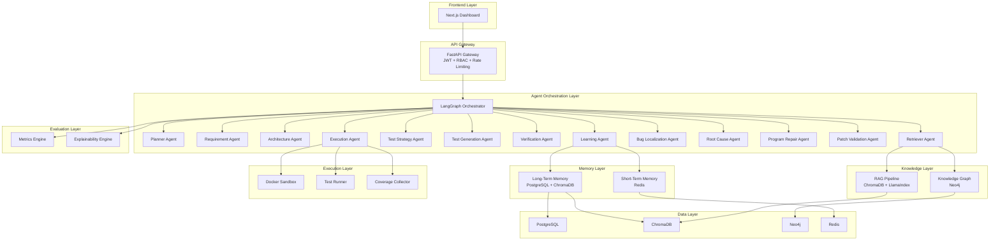
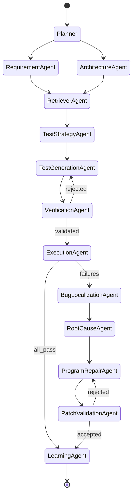
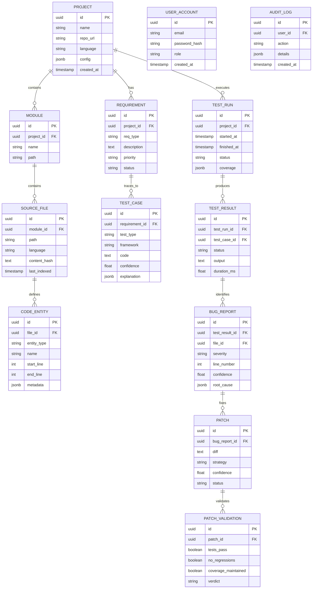

# AutoTestAI — Phase 1: System Architecture

## Goal

Design the complete system architecture for AutoTestAI — an agentic multi-agent Software Quality Engineering platform. This phase produces all foundational artifacts: HLD, LLD, folder structure, database schema, knowledge graph schema, API contracts, and agent orchestration design.

---

## High-Level Design (HLD)



### Architectural Decisions

| Decision | Choice | Rationale |
|----------|--------|-----------|
| Agent framework | LangGraph | Stateful, cyclic graphs with checkpointing; superior to CrewAI for complex multi-agent orchestration |
| RAG engine | LlamaIndex + ChromaDB | Production-grade indexing, hybrid retrieval (dense + sparse), metadata filtering |
| Knowledge graph | Neo4j | Industry standard, Cypher query language, APOC procedures, native graph algorithms |
| API framework | FastAPI | Async-native, OpenAPI auto-docs, dependency injection, Pydantic validation |
| Frontend | Next.js 14 + App Router | SSR/SSG, React Server Components, API routes, TypeScript-first |
| Database | PostgreSQL | ACID compliance, JSONB for flexible schemas, full-text search, mature ecosystem |
| Sandbox | Docker-in-Docker | Process isolation for test execution and patch validation |
| State management | LangGraph Checkpointing | Built-in persistence, state snapshots, resumable workflows |

---

## Low-Level Design (LLD)

### Agent State Schema

Every agent operates on a shared `AgentState` TypedDict flowing through the LangGraph graph:

```python
class AgentState(TypedDict):
    project_id: str
    session_id: str
    messages: list[BaseMessage]
    project_context: ProjectContext        # parsed project metadata
    requirements: list[Requirement]        # extracted requirements
    architecture: ArchitectureGraph        # dependency/API/service graphs
    retrieved_context: list[RetrievedDoc]  # RAG results
    kg_context: list[KGTriple]            # Knowledge Graph query results
    test_strategy: TestStrategy            # test type decisions
    generated_tests: list[TestCase]        # generated test code
    verification_results: VerificationReport
    execution_results: ExecutionReport
    bug_localizations: list[BugLocalization]
    root_causes: list[RootCause]
    patches: list[Patch]
    patch_validations: list[PatchValidation]
    explanations: list[Explanation]        # XAI traces
    agent_trace: list[AgentAction]         # full audit trail
    iteration: int
    status: Literal["planning", "analyzing", "testing", "debugging", "repairing", "validating", "complete"]
```

### Agent Graph Topology (LangGraph)



---

### Database Schema (PostgreSQL)



---

### Knowledge Graph Schema (Neo4j)

```
(:Project {id, name, repo_url})
  -[:CONTAINS_MODULE]-> (:Module {name, path})
    -[:CONTAINS_PACKAGE]-> (:Package {name, path})
      -[:CONTAINS_CLASS]-> (:Class {name, file, start_line, end_line})
        -[:HAS_METHOD]-> (:Method {name, params, return_type, start_line, end_line})
        -[:INHERITS]-> (:Class)
        -[:IMPLEMENTS]-> (:Interface)
      -[:CONTAINS_FUNCTION]-> (:Function {name, params, return_type})

(:Project)
  -[:HAS_TABLE]-> (:DatabaseTable {name, schema})
    -[:HAS_COLUMN]-> (:Column {name, type, nullable, primary_key})

(:Project)
  -[:EXPOSES_API]-> (:RESTEndpoint {method, path, handler})
    -[:ACCEPTS]-> (:RequestSchema)
    -[:RETURNS]-> (:ResponseSchema)

(:Method)-[:CALLS]-> (:Method)
(:Method)-[:USES_TABLE]-> (:DatabaseTable)
(:RESTEndpoint)-[:HANDLED_BY]-> (:Method)

(:Requirement {id, type, description, priority})
  -[:TRACED_TO]-> (:TestCase {id, type, framework, code})
(:TestCase)-[:TESTS]-> (:Method)
(:TestCase)-[:PRODUCED_RESULT]-> (:TestResult {status, duration})

(:TestResult)-[:IDENTIFIED_BUG]-> (:Bug {severity, confidence, line})
(:Bug)-[:LOCALIZED_IN]-> (:Method)
(:Bug)-[:FIXED_BY]-> (:Patch {diff, strategy, status})
(:Patch)-[:VALIDATED_BY]-> (:PatchValidation {verdict})
```

---

### REST API Design (v1)

| Method | Endpoint | Description |
|--------|----------|-------------|
| POST | `/api/v1/projects` | Create/import project |
| GET | `/api/v1/projects/{id}` | Get project details |
| POST | `/api/v1/projects/{id}/analyze` | Trigger full analysis pipeline |
| GET | `/api/v1/projects/{id}/requirements` | List extracted requirements |
| GET | `/api/v1/projects/{id}/architecture` | Get architecture graph |
| POST | `/api/v1/projects/{id}/tests/generate` | Trigger test generation |
| GET | `/api/v1/projects/{id}/tests` | List generated tests |
| POST | `/api/v1/projects/{id}/tests/execute` | Execute test suite |
| GET | `/api/v1/projects/{id}/runs/{run_id}` | Get test run results |
| GET | `/api/v1/projects/{id}/bugs` | List detected bugs |
| POST | `/api/v1/projects/{id}/bugs/{bug_id}/repair` | Trigger auto-repair |
| GET | `/api/v1/projects/{id}/patches` | List generated patches |
| GET | `/api/v1/projects/{id}/knowledge-graph` | Query knowledge graph |
| GET | `/api/v1/projects/{id}/metrics` | Get coverage, risk, confidence |
| POST | `/api/v1/auth/login` | JWT login |
| POST | `/api/v1/auth/register` | User registration |
| GET | `/api/v1/agents/status` | Agent pipeline status (SSE) |
| GET | `/api/v1/agents/trace/{session_id}` | Get XAI explanation trace |

---

## Project Folder Structure

```
autotest/
├── backend/
│   ├── app/
│   │   ├── __init__.py
│   │   ├── main.py                    # FastAPI application factory
│   │   ├── api/
│   │   │   ├── v1/
│   │   │   │   ├── endpoints/
│   │   │   │   │   ├── projects.py
│   │   │   │   │   ├── tests.py
│   │   │   │   │   ├── bugs.py
│   │   │   │   │   ├── patches.py
│   │   │   │   │   ├── agents.py
│   │   │   │   │   ├── knowledge.py
│   │   │   │   │   ├── auth.py
│   │   │   │   │   └── metrics.py
│   │   │   │   └── router.py          # API router aggregator
│   │   │   └── deps.py                # Dependency injection
│   │   ├── core/
│   │   │   ├── config.py              # Pydantic Settings
│   │   │   ├── security.py            # JWT, hashing, RBAC
│   │   │   ├── exceptions.py          # Custom exception hierarchy
│   │   │   └── logging.py             # Structured logging
│   │   ├── models/                    # SQLAlchemy ORM models
│   │   ├── schemas/                   # Pydantic request/response schemas
│   │   ├── services/                  # Business logic layer
│   │   ├── agents/
│   │   │   ├── orchestrator.py        # LangGraph graph definition
│   │   │   ├── state.py               # AgentState TypedDict
│   │   │   ├── nodes/                 # One file per agent node
│   │   │   │   ├── planner.py
│   │   │   │   ├── requirement.py
│   │   │   │   ├── architecture.py
│   │   │   │   ├── retriever.py
│   │   │   │   ├── test_strategy.py
│   │   │   │   ├── test_generation.py
│   │   │   │   ├── verification.py
│   │   │   │   ├── execution.py
│   │   │   │   ├── bug_localization.py
│   │   │   │   ├── root_cause.py
│   │   │   │   ├── program_repair.py
│   │   │   │   ├── patch_validation.py
│   │   │   │   └── learning.py
│   │   │   └── tools/                 # Agent-callable tools
│   │   ├── knowledge/
│   │   │   ├── graph/                 # Neo4j client, Cypher queries
│   │   │   └── rag/                   # LlamaIndex indexing, ChromaDB
│   │   ├── memory/                    # Short-term (Redis) + Long-term
│   │   ├── execution/                 # Docker sandbox, test runners
│   │   ├── evaluation/                # Metrics, XAI engine
│   │   ├── repair/                    # Patch generation strategies
│   │   └── utils/
│   ├── tests/
│   ├── alembic/                       # Database migrations
│   ├── pyproject.toml
│   └── Dockerfile
├── frontend/
│   ├── src/
│   │   ├── app/                       # Next.js App Router pages
│   │   ├── components/
│   │   │   ├── ui/                    # Shadcn primitives
│   │   │   ├── dashboard/             # Dashboard widgets
│   │   │   ├── agents/                # Agent visualization
│   │   │   └── knowledge/             # KG visualization
│   │   ├── lib/                       # API client, utilities
│   │   ├── hooks/                     # Custom React hooks
│   │   ├── types/                     # TypeScript interfaces
│   │   └── styles/
│   ├── package.json
│   ├── tailwind.config.ts
│   ├── tsconfig.json
│   └── Dockerfile
├── deployment/
│   ├── docker/
│   │   └── docker-compose.yml
│   ├── k8s/
│   └── github-actions/
│       └── ci.yml
├── docs/
│   ├── architecture/
│   ├── api/
│   └── research/
├── scripts/
├── .env.example
├── .gitignore
└── README.md
```

---

## Phased Execution Plan

| Phase | Scope | Key Deliverables |
|-------|-------|------------------|
| 1 | Architecture ✅ | HLD, LLD, ER diagram, KG schema, API design, folder structure |
| 2 | Backend Core | FastAPI app, models, schemas, auth, config, migrations |
| 3 | Frontend Shell | Next.js app, layout, routing, auth pages, design system |
| 4 | Agent Layer | LangGraph orchestrator, all 13 agent nodes, state management |
| 5 | Knowledge Graph | Neo4j integration, graph construction, Cypher query service |
| 6 | RAG Pipeline | LlamaIndex indexing, ChromaDB storage, hybrid retrieval |
| 7 | Test Execution | Docker sandbox, test runners (PyTest/JUnit/Playwright/Newman) |
| 8 | Program Repair | Patch generation, isolated validation, regression checking |
| 9 | Dashboard | Agent workflow viz, KG explorer, coverage/bug/patch analytics |
| 10 | Evaluation & Docs | Metrics, XAI, Docker Compose, CI/CD, README, research paper |

---

## Verification Plan

### Automated Tests
- `pytest` for all backend services, agents, and API endpoints
- `playwright` for frontend E2E tests
- `docker compose up` to verify full stack integration

### Manual Verification
- Knowledge graph visualization in Neo4j Browser
- Dashboard walkthrough via browser
- End-to-end pipeline test: import project → generate tests → execute → repair → validate

---

> [!IMPORTANT]
> **Awaiting your approval** to proceed to **Phase 2: Backend Core** — FastAPI application factory, SQLAlchemy models, Pydantic schemas, JWT auth, database migrations, and core configuration.
